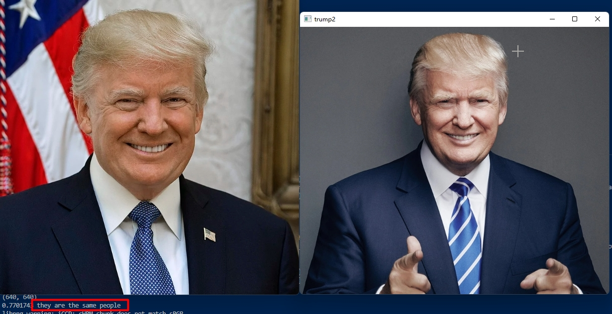
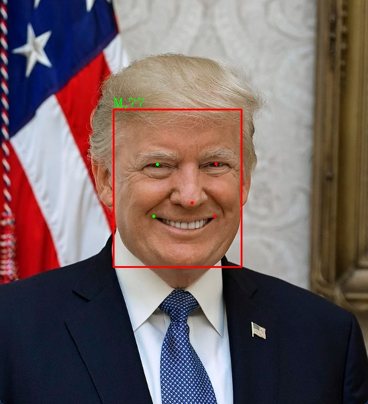
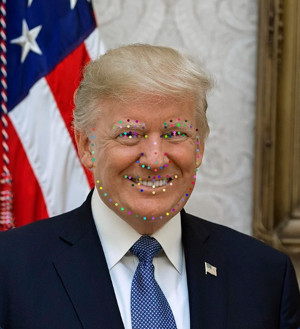
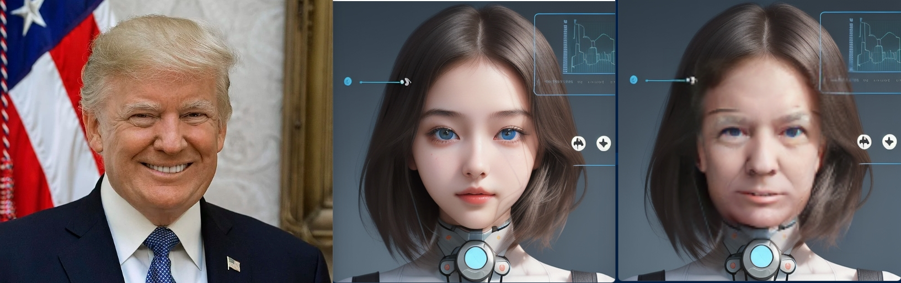

# Heimarobot Python Library

## License

The code of heimarobot Python Library is released under the MIT License. There is no limitation for both academic and commercial usage.

Heimarobot Python Library is an artificial intelligence learning library, including mainstream advanced artificial intelligence libraries, such as InsightFace, yolov8, paddleocr, etc.


本项目具备如下推理功能：

- 人脸检测
- 人脸识别
- 人脸年龄与性别识别
- 人脸106个特征点
- 换脸

B站演示地址: https://space.bilibili.com/485304569

## 安装

安装opencv

```python
pip install opencv-python-headless==4.6.0.66
pip install opencv-python==4.6.0.66
pip install opencv-contrib-python==4.6.0.66
```

安装onnxruntime

```python
pip install onnxruntime
```

若你的电脑支持gpu,可以进入如下安装

```python
pip install onnxruntime-gpu
```

pip安装

```python
pip install heimarobot==0.0.3
```

若安装失败，请指定安装路径

```python
pip install heimarobot==0.0.3 -i https://pypi.tuna.tsinghua.edu.cn/simple
```


### 导入权重文件

在用户目录下新建`.heimarobot`文件夹

```python
C:\Users\KAI\.heimarobot\models
在models里面放入权重文件
```

从百度网盘中下载权重文件,并解压释放进去


## 功能演示

### 人脸检测


```python
from heimarobot import FaceDetection
from heimarobot import draw_faces
import cv2 as cv
import numpy as np

if __name__ == '__main__':
    face_detection = FaceDetection()
    img = cv.imread('images/trump1.jpg')
    faces = face_detection.predict(img)
   
    dst = draw_faces(img,faces)
    
    cv.imshow('img',dst)
    cv.waitKey(0)

```


### 人脸识别




```python
from heimarobot import FaceRecognition
import cv2 as cv
import numpy as np

if __name__ == '__main__':
    face_recognition = FaceRecognition()
    trump1 = cv.imread('images/trump1.jpg')
    trump2 = cv.imread('images/trump2.jpg')
    
    # 获取人脸特征
    feats1 = face_recognition.predict(trump1)
    feats2 = face_recognition.predict(trump2)
    
    sim = face_recognition.compute_sim(feats1,feats2)

    # 根据相似度,输出结果
    if sim<0.2:
        conclu = 'they are not the same'
    elif sim>=0.2 and sim<0.28:
        conclu = 'they are looks like the same people'
    else:
        conclu = 'they are the same people'

    print(sim,conclu)

    cv.imshow('trump1',trump1)
    cv.imshow('trump2',trump2)
    cv.waitKey(0)
```


### 人脸年龄与性别识别




```python
from heimarobot import FaceAttribute
from heimarobot import draw_faces
import cv2 as cv
import numpy as np

if __name__ == '__main__':
    face_attr = FaceAttribute()
    img = cv.imread('images/trump1.jpg')
    
    # 获取人脸特征
    faces = face_attr.predict(img)
    # 1 表示男性， 0，表示女性
    print(faces[0])
    dst = draw_faces(img,faces)
    cv.imshow("images/1.jpg",dst)
    cv.waitKey(0)

```


### 人脸106个特征点




```python
from heimarobot import FaceLandmark
import cv2 as cv
import numpy as np
from heimarobot import draw_faces,draw_landmarks

if __name__ == '__main__':
    face_attr = FaceLandmark()
    trump1 = cv.imread('images/trump1.jpg')

    # 获取人脸特征106个特征点
    faces = face_attr.predict(trump1)

    retimg = draw_landmarks(trump1,faces)
    cv.imshow('trump1_landmark',retimg)
    cv.waitKey(0)

```


### 换脸




```python
from heimarobot import FaceSwapper

import cv2 as cv
import numpy as np

if __name__ == '__main__':
    face_swapper = FaceSwapper()
    trump1 = cv.imread('images/trump1.jpg')
    target = cv.imread('images/1.jpg')

    sourceFace = face_swapper.get_source_face(trump1)

    dst = face_swapper.predict(sourceFace, target)
   
    cv.imshow("trump1",trump1)
    cv.imshow("1",target)
    cv.imshow("dst", dst)
    cv.waitKey()
```


若运行代码出现一下错误，则是` opencv-python-headless`与`opencv-python`版本不匹配的原因

```python
cv2.error: OpenCV(4.7.0) D:\a\opencv-python\opencv-python\opencv\modules\highgui\src\window.cpp:1272: error: (-2:Unspecified error) The function is not implemented. Rebuild the library with Windows, GTK+ 2.x or Cocoa support. If you are on Ubuntu or Debian, install libgtk2.0-dev and pkg-config, then re-run cmake or configure script in function 'cvShowImage'
```

卸载` opencv-python-headless`,重新安装

```python
pip install opencv-python-headless==4.6.0.66
pip install opencv-python==4.6.0.66
pip install opencv-contrib-python==4.6.0.66
```


本项目参考以下工程:

[InsightFace](https://insightface.ai/)

[PaddleOCR](https://github.com/PaddlePaddle/PaddleOCR)


